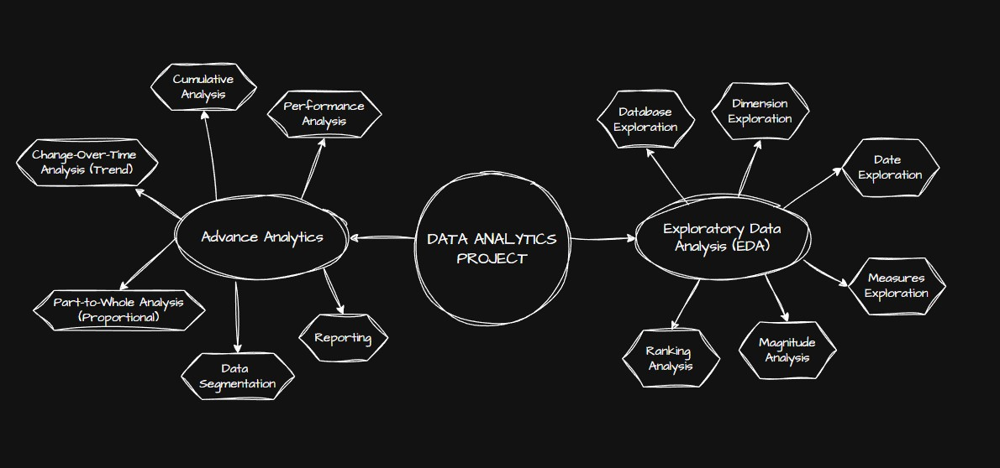

# Data Analytics Project

## Project Overview

This project focuses on performing comprehensive **Data Analytics** through a combination of **Exploratory Data Analysis (EDA)** and **Advanced Analytics** techniques. The objective of the project is to transform raw data into meaningful insights, identify business patterns, and support data-driven decision-making.

The project covers multiple analytical approaches including trend analysis, segmentation, ranking, performance evaluation, and cumulative analysis to better understand the data from different perspectives.

---

## Project Goals

- Perform structured and scalable data analysis.
- Identify trends, patterns, and business opportunities.
- Generate actionable insights using SQL-based analytics.
- Build a strong foundation for reporting and dashboard development.
- Demonstrate practical applications of data analytics concepts and techniques.

---

## Exploratory Data Analysis (EDA)

The EDA phase focuses on understanding the dataset structure, identifying patterns, and exploring relationships within the data.

### Key Areas Covered
- **Database Exploration**  
  Understanding tables, relationships, schemas, and data structure.

- **Dimension Exploration**  
  Analyzing categorical dimensions such as customers, products, regions, and categories.

- **Date Exploration**  
  Identifying the earliest and latest dates, Understanding the scope of our data and timespan.

- **Measures Exploration**  
  Exploring key business metrics such as total_sales, total_quantity, total_orders, total_customers, total_products.

- **Magnitude Analysis**  
  Comparing measure values by categories.
  Helps us understand the importance of different categories.
  Example: total customers by country, total products by categories
  

- **Ranking Analysis**  
  Ranking entities such as top customers, products, and categories based on performance.

---

## Advanced Analytics

The Advanced Analytics phase focuses on deriving actionable insights and identifying deeper business trends.

### Key Areas Covered
- **Change-Over-Time Analysis (Trend Analysis)**  
  Analyzing how business metrics evolve over time. Help us to track trends and identify seasonality in our data. Example: Analyze sales performance over time.

- **Cumulative Analysis**  
  Aggregating data progressively over time. helps us understand whether our business is growing or declining.

- **Performance Analysis**  
  Comparing Current Value to Target Value. Helps us to measure success and compare performance

- **Part-to-Whole Analysis (Proportional Analysis)**  
  Analyze how an individual part is performing compared to the overall. Helps us understand which category has the greatest impact in the business.

- **Data Segmentation**  
  Grouping data into meaningful segments for targeted analysis.

- **Reporting**  
  Creating reports for business insights. Here we have reports for customers and products as VIEWS in gold layer.
  
- **Dashboards-**
  Using the CSV files exported from MySQL, I have created dashboards like **Executive Summary**, **Customer Analytics** and **Product Performance**

---

## Tools & Technologies

- **MySQL**
- **SQL**
- **Data Analytics**
- **Exploratory Data Analysis (EDA)**
- **Advanced Analytics**
- **Microsoft PowerBI**
- **Reporting & Visualization**

